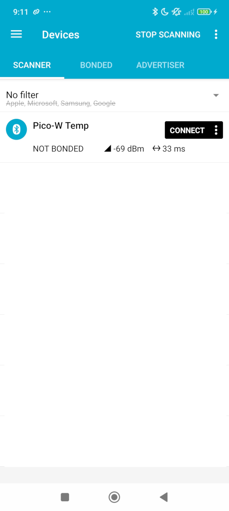
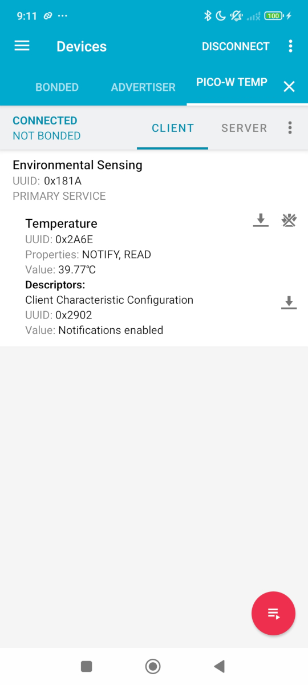

# Pico-W BLE Temperature Sensor

This project implements a Bluetooth Low Energy (BLE) temperature sensor using the Raspberry Pi Pico W. The sensor reads the temperature of the Pico W and sends notifications to connected BLE clients.

## Features

- Reads temperature from the internal onboard sensor of the Pico W.
- Sends temperature notifications to connected BLE clients.
- Supports BLE characteristic read and notify properties.

## Notes ⚠️
- [Arduino Wrapper for BTstack library does not support notifications.](https://github.com/bluekitchen/btstack/issues/551#issuecomment-1827805004) 
- The code has been modified as a workaround to support notifications.
- Notifications are sent when temperature has changed and client is not busy.

## Hardware Requirements

- Raspberry Pi Pico W

## Software Requirements

- PlatformIO
- [platformio.ini](platformio.ini) configuration for Raspberry Pi Pico W


## Setup

1. **Install PlatformIO**: Follow the instructions on the [PlatformIO website](https://platformio.org/install) to install PlatformIO.
    - note: vscode will auto-prompt the PlatformIO extension to be installed.

2. **Clone the Repository**:
    ```sh
    git clone https://github.com/yourusername/pico-w-ble-temperature.git
    cd pico-w-ble-temperature
    ```

3. **Open the Project**: Open the project folder in Visual Studio Code.

4. **Build and Upload**: Use the PlatformIO extension in Visual Studio Code to build and upload the firmware to the Pico W.

## Usage

1. **Power the Pico W**: Connect the Pico W to your computer via USB.

2. **Monitor Serial Output**: Open the serial monitor in PlatformIO to view the temperature readings and BLE connection status.

3. **Connect via BLE**: Use a BLE client (e.g., a smartphone app like `nRF Connect`) to connect to the Pico W and receive temperature notifications.

 


## License

This project is licensed under the MIT License. See the LICENSE file for details.

## Acknowledgements/References

- [onboard_temperature.c](https://github.com/raspberrypi/pico-examples/blob/master/adc/onboard_temperature/onboard_temperature.c)
- [arduino-pico BLE examples](https://github.com/earlephilhower/arduino-pico/tree/b506c010f7766cfb181c8da6db93cb8d554460f6/libraries/BTstackLib/examples)
- [BTstackLib LE Peripheral Notify client on Characteristic Change
#551](https://github.com/bluekitchen/btstack/issues/551#issuecomment-1827805004)
    - [comment 1](https://github.com/bluekitchen/btstack/issues/551#issuecomment-1827805004)
    - [comment 2](https://github.com/bluekitchen/btstack/issues/551#issuecomment-2257178367)

